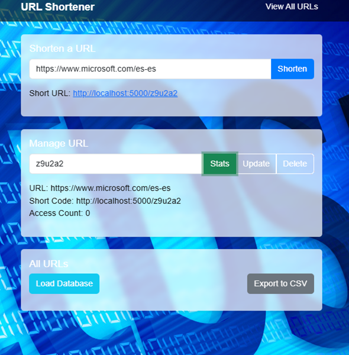

# URL Shortener

## Descripción
Este es un servicio de acortamiento de URLs desarrollado con Python, Flask, SQLAlchemy y SQLite. Permite a los usuarios crear URLs cortas, gestionarlas (actualizar, eliminar, ver estadísticas), y visualizar todas las URLs en una interfaz web moderna y responsiva. La aplicación utiliza Bootstrap para el diseño y se puede alojar localmente o en un servidor.

## Características
- Crear URLs cortas únicas.
- Redirigir a la URL original desde el código corto.
- Ver estadísticas de acceso (cuántas veces se accedió a una URL corta).
- Actualizar o eliminar URLs existentes.
- Interfaz web interactiva con tabla de datos y exportación a CSV.
- Fondo futurista con diseño moderno.

## Tecnologías utilizadas
- **Lenguaje**: Python 3.x
- **Framework**: Flask
- **Base de datos**: SQLite (con SQLAlchemy)
- **Frontend**: HTML, CSS (Bootstrap), JavaScript
- **Herramientas**: Git, GitHub, VS Code

## Instalación

### Requisitos
- Python 3.8 o superior
- Git (para clonar el repositorio)
- pip (gestor de paquetes de Python)

### Pasos
1. Clona este repositorio:
   ```bash
   git clone https://github.com/TuUsuario/url-shortener.git
   cd url-shortener

2. Crea un entorno virtual:
    ```bash
    python -m venv venv
    venv\Scripts\activate  # En Windows
    source venv/bin/activate  # En Linux/Mac

3. Instala dependecias:
    ```bash
    pip install flask flask-sqlalchemy python-dotenv


4. Configura la variable de entorno BASE_URL (opcional, en .env):
    BASE_URL=http://localhost:5000/

5. Ejecuta la aplicación:
    ```bash
    python app.py

6. Abre el navegador y visita http://localhost:5000.

USO
* Ingresa una URL en el formulario "Shorten a URL" para crear un código corto.
* Usa "Manage URL" para ver estadísticas, actualizar o eliminar una URL existente.
* Haz clic en "Load Database" para ver todas las URLs y "Export to CSV" para descargar los datos.

CAPTURAS DE PANTALLA

Interfaz principal


Gestión de URL


Tabla de URLs


LICENCIA

Este proyecto está bajo la licencia MIT. Ver LICENSE para más detalles.

CONTRIBUCIONES

Si deseas contribuir, por favor abre un issue o envía un pull request en GitHub. ¡Agradecemos tus sugerencias!